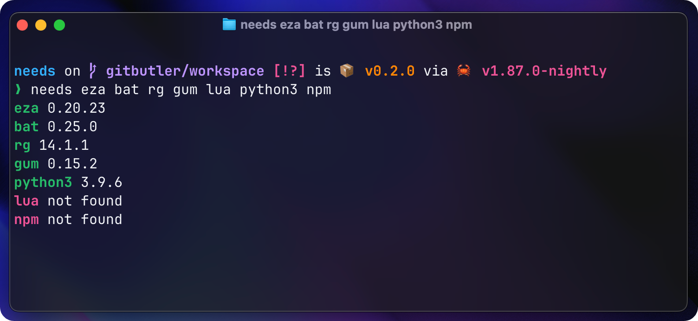
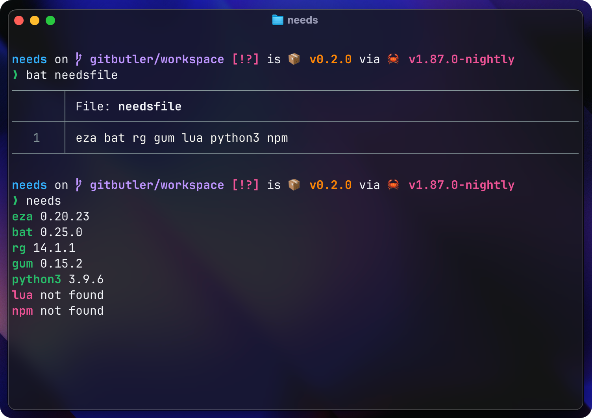

# needs
> Check if given bin(s) are available in the PATH.

*...multi-threaded of course.*

## Usage
```bash
needs <bin>...
```

*or*

```bash
# returns 0 if all bins are available, 1 otherwise
needs -q <bin>...
```

## Example
```bash
needs eza bat rg gum lua python3 npm
```

## Output
> using cli args



> using needsfile


